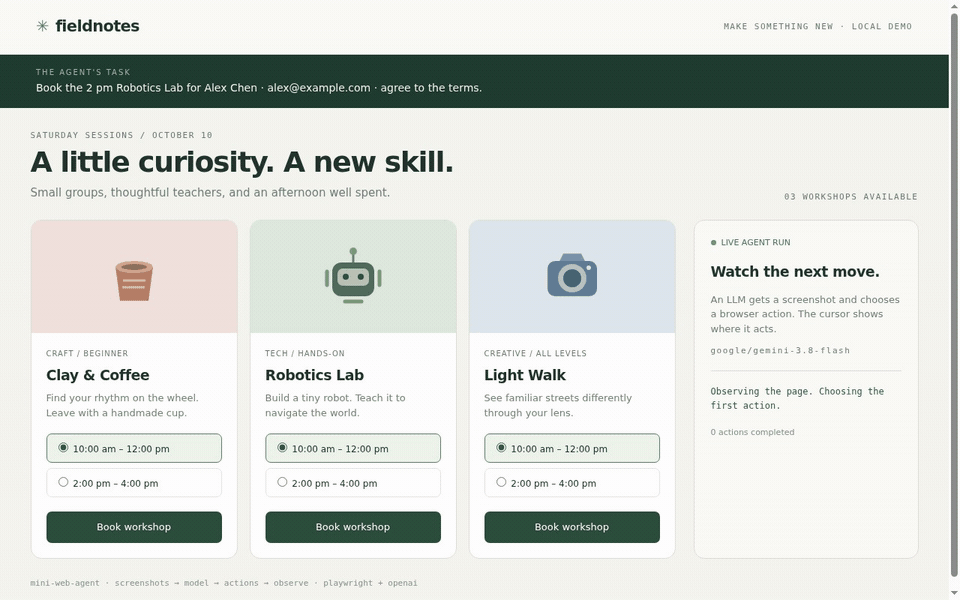

# Frontier web agents in less than 400 lines

**mini-web-agent** connects a multimodal LLM to a browser through an OpenAI-compatible
Responses API. Screenshots in, browser actions out.

- **Small:** [agent.py](agent.py) contains browser control, tool schemas, and the agent loop
  in fewer than 400 lines.
- **Two dependencies:** Playwright for browser control and the OpenAI SDK for API calls.
- **Screenshots:** The model sees screenshots and the current tab list.
- **Explicit actions:** 24 functions for navigation, pointer input, typing, tabs, and conversation.
- **Persistent browser:** Launch Chrome as a separate process or connect to a running session over CDP.
- **Easy to adapt:** Use your own actions, instructions, and callbacks.

<details>
<summary>Why keep it small?</summary>

Modern models can do useful work with very little agent code. That is the premise behind
[mini-swe-agent](https://github.com/SWE-agent/mini-swe-agent#readme), and the idea this project
explores in the browser. Give the model screenshots and browser controls, then let it
decide how to complete the task.

Keeping the implementation under 400 lines gives you a baseline you can read, run, and change.
Swap the model, adjust the prompt, or change the actions to see what affects its behavior.
The full interaction stays in history, so you can inspect each step. The goal is to make
browser agents easy to experiment with and build on.

</details>



*Gemini 3.8 Flash books a workshop through OpenRouter. Pauses between actions are shortened.
[Action log](demo/demo.json).*

**Inside [agent.py](agent.py)** — line counts include blank lines and docstrings.

| Section | What it does | Lines |
| --- | --- | ---: |
| [Imports](agent.py#L1) | Standard library, OpenAI SDK, and Playwright | 17 |
| [Actions](agent.py#L18) | 24 browser and conversation functions | 95 |
| [Helpers](agent.py#L113) | Prompts, browser setup, tab lookup, tool schemas, and screenshot formatting | 72 |
| [WebAgent](agent.py#L185) | Chrome lifecycle, tabs, actions, and screenshots | 129 |
| [run()](agent.py#L314) | Model calls, results, callbacks, history, and recovery | 51 |
| [CLI](agent.py#L365) | Options, browser setup, model run, and cleanup | 35 |
| **Total** | | **399** |

The count includes the CLI. The cursor, uv launcher, demo recorder, and tests are separate files.

<details>
<summary>Record your own demo</summary>

After the manual setup below, install [FFmpeg](https://ffmpeg.org/download.html) and run:

```bash
python demo/record.py --model google/gemini-3.8-flash
```

The recorder uses the agent to complete a booking on a local page, captures the browser
through CDP, and checks the confirmation. It saves `demo/demo.gif` and `demo/demo.json`.
FFmpeg is only needed for recording.

</details>

## Quick start

With [uv](https://docs.astral.sh/uv/getting-started/installation/) installed:

```bash
git clone https://github.com/xhluca/mini-web-agent.git
cd mini-web-agent
uv run mini-web-agent
```

The launcher asks for a task and your OpenRouter API key, then installs Chromium if needed.
By default, it uses Gemini 3.8 Flash and runs Chrome headless. It works on Linux and macOS.

<details>
<summary>Manual setup with venv</summary>

You need Python 3.10+ and a model that supports images and function calls.

```bash
git clone https://github.com/xhluca/mini-web-agent.git
cd mini-web-agent
python3 -m venv .venv
source .venv/bin/activate
python -m pip install .
python -m playwright install chromium --no-shell

export OPENAI_API_KEY="your-openrouter-key"
export OPENAI_BASE_URL=https://openrouter.ai/api/v1

python -u agent.py --headed --cursor --model google/gemini-3.8-flash \
  'Open https://example.com and tell me the heading.'
```

Chrome opens in a window, with an animated cursor showing the agent's pointer actions.
The agent runs in the foreground: actions, results, and questions appear in your terminal.
Leave out `--headed` to run Chrome headless and `--cursor` to hide the cursor.
Press **Ctrl+C** to interrupt.

</details>

<details>
<summary>CLI options and connecting to Chrome</summary>

| Option | Purpose |
| --- | --- |
| `--model` | Defaults to `google/gemini-3.8-flash` with uv; required when running `agent.py` directly |
| `--max-steps` | Maximum model turns; defaults to 100 |
| `--profile` | Persistent Chrome profile; defaults to `.chrome` |
| `--port` | Launch port; a new profile defaults to a random localhost port |
| `--connect` | Attach to Chrome already running with the selected profile |
| `--headed` | Show Chrome; new launches are headless by default |
| `--cursor` | Animate pointer actions before execution |

To watch the agent in Chrome:

```bash
uv run mini-web-agent 'Read example.com' --headed --cursor
```

The launcher accepts the same arguments as `agent.py`. You can set `OPENAI_API_KEY` and
`OPENAI_BASE_URL` to skip the key prompt and choose an API endpoint.

To attach to a browser previously launched with this profile:

```bash
python -u agent.py --connect --profile .chrome --model google/gemini-3.8-flash \
  'Tell me what is open in the current tab.'
```

Connecting keeps the browser's existing tabs and display mode. If you add `--headed`,
the CLI warns that it cannot change how Chrome was launched, then continues.
The CLI closes browsers it launches. With `--connect`, it leaves Chrome running.

When launching Chrome, the CLI replaces restored tabs with one blank tab and keeps profile data.
Use `--port 9222` for a fixed launch port. With `--port 0`, Chrome chooses a port for a new
profile. Existing profiles reuse their recorded port. `--connect` reads the
profile's address and cannot be combined with a nonzero `--port`.
The CLI prints the CDP address after connecting.

The agent uses the Chromium installed by Playwright. On minimal Linux systems, install
its system dependencies with `python -m playwright install-deps chromium`.

</details>

## Use it from Python

Set the API environment variables shown in the manual setup, then:

```python
from openai import OpenAI
from agent import WebAgent, get_action_space, get_instructions, run

agent = WebAgent(".chrome", action_space=get_action_space())
try:
    agent.launch().connect()
    with OpenAI(timeout=60, max_retries=1) as client:
        answer = run(
            agent, "Find the heading on https://example.com.", client,
            model="google/gemini-3.8-flash", instructions=get_instructions(),
            max_steps=20, callbacks=[dict(type="after", function=print)],
        )
        print(answer)
finally:
    agent.shutdown()
```

Use `agent.launch(headed=True)` for a visible browser. To leave Chrome running for another task,
call `agent.disconnect()` instead of `agent.shutdown()`.

<details>
<summary>Browser lifecycle</summary>

| Function | What it does |
| --- | --- |
| `agent.launch()` | Start detached Chrome |
| `agent.connect()` | Attach Playwright to Chrome |
| `agent.get_page()` | Get the active tab and set its viewport |
| `agent.observe()` | Return tab metadata as JSON and a screenshot data URL |
| `agent.act(name, arguments)` | Execute an allowed action and return its result |
| `run(agent, task, client, model, instructions, ...)` | Run the model loop |
| `agent.disconnect()` | Detach Playwright, leaving Chrome running |
| `agent.shutdown()` | Close Chrome and disconnect, even if Chrome was already running when you connected |

Use `port=9222` for a fixed port, or leave it at `0` to let the agent choose.
After launch, `agent.port` holds the port Chrome is using. Another `WebAgent` can reconnect
using the same profile. Playwright finds Chrome's WebSocket address over HTTP.

</details>

<details>
<summary>Customize actions, instructions, and callbacks</summary>

`action_space` and `instructions` are required. Pass an action dictionary and a prompt,
or use `get_action_space()` and `get_instructions()`. The action dictionary determines
the tool schemas and which functions the model can call.

Callbacks receive `(step, action, result)`, where `step` is the model-turn index,
`action` contains the name and arguments, and `result` is `None` before execution.
Use `type="before"` or `type="after"` to choose when each callback runs:

```python
from functools import partial
from cursor import show_cursor

callbacks = [
    dict(type="before", function=partial(show_cursor, agent)),
    dict(type="after", function=print),
]
```

The optional [cursor.py](cursor.py) overlay glides between targets, traces drags, and
pulses on clicks. It respects reduced-motion preferences and does not intercept clicks.
The CLI loads it only with `--cursor`.

`on_message` handles messages to the user, and `on_reply` asks for a reply.
They default to `print` and `input`.

</details>

## How it works

1. Take a screenshot and list the open tabs.
2. Send them to the model using the Responses API.
3. Call the chosen functions and send back their results.
4. Take another screenshot after each batch of actions. Repeat until the model calls `finish`.

<details>
<summary>Available actions</summary>

The 24 actions are ordinary functions grouped in `Actions`:

| Interaction | Actions |
| --- | --- |
| Navigation | `navigate`, `back`, `forward`, `reload` |
| Pointer | `click`, `double_click`, `right_click`, `hover`, `mouse_down`, `mouse_up`, `drag` |
| Scroll and keyboard | `scroll`, `type_text`, `press_key`, `key_down`, `key_up` |
| Tabs | `list_tabs`, `new_tab`, `switch_tab`, `close_tab` |
| Timing and conversation | `wait`, `send_message`, `wait_for_reply`, `finish` |

Action coordinates match the screenshot. The viewport defaults to 1280×800; pass `w` and `h`
to `WebAgent` to change it. `type_text` types into the focused field, with 10 ms between characters.
Tab indices come from the latest observation and can shift after closing a tab.

</details>

<details>
<summary>History and error recovery</summary>

The first screenshot is sent as a user message. After each batch of actions, the last tool
result includes a screenshot and the current tab information. Each action returns one of:

```python
{"state": "success", "output": ...}
{"state": "error", "output": "..."}
```

Action errors are sent back to the model so it can try again. If the model returns no tool
calls, the loop asks it to choose an action. Incomplete responses are discarded and retried
without executing any actions. Retries count toward `max_steps`; the loop stops at that
limit even if the task is unfinished.
A successful `finish` returns the final answer.

Earlier screenshots and reasoning stay in history so providers can cache the unchanged
prefix. Longer tasks use more context, and cache hits depend on the provider.

</details>

<details>
<summary>Scope</summary>

There are no tools for reading the DOM, parsing accessibility trees, running generated code,
managing uploads or downloads, or controlling the OS. The model can call only the functions
in the action dictionary. The browser can still visit websites and interact with them normally.

</details>

## Development

Start with [agent.py](agent.py), [cursor.py](cursor.py), or the [demo recorder](demo/record.py).
Tests live in [tests/](tests/).

```bash
python -m unittest discover -s tests -v
python -m tests.test_live  # Optional paid OpenRouter test.
```

The local tests use Chromium and a test server to check actions, tabs, cleanup, API results,
and error recovery. The live test asks the model to complete a signup form and checks the result.
